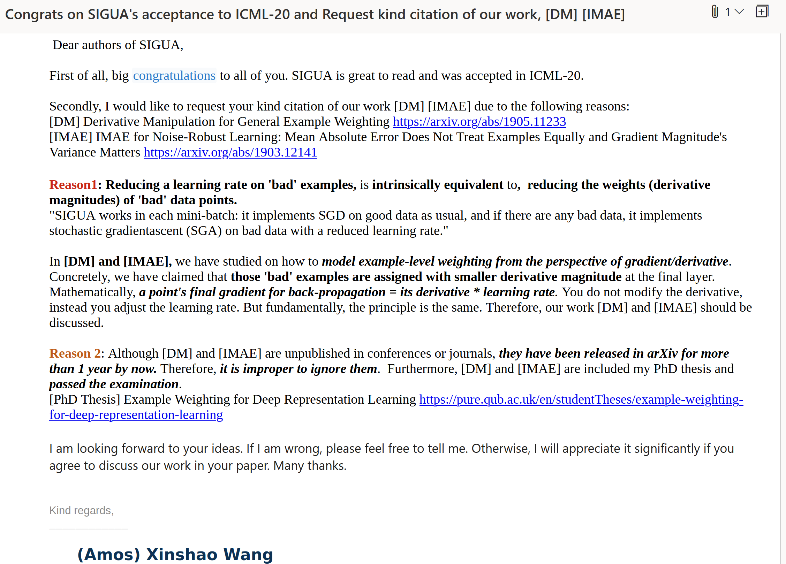

For source codes, the usage is conditioned on academic use only and kindness to cite our work: Derivative Manipulation and IMAE.<br />
As a young researcher, your interest and kind citation (star) will definitely mean a lot for me and my collaborators.<br />
For any specific discussion or potential future collaboration, please feel free to contact me. 


## :+1: Selected work partially impacted by our work
* [ICML-20: Normalized Loss Functions for Deep Learning with Noisy Labels](https://arxiv.org/pdf/2006.13554.pdf)
* [ICML-20: SIGUA: Forgetting May Make Learning with Noisy Labels More Robust](https://proceedings.icml.cc/static/paper_files/icml/2020/705-Paper.pdf)
  * [Notes and remarks](https://xinshaoamoswang.github.io/blogs/2020-06-14-Robust-Deep-LearningviaDerivativeManipulationIMAE/#how-do-you-think-of-requesting-kind-citations)

* [NeurIPS-20: Early-Learning Regularization Prevents Memorization of Noisy Labels](https://proceedings.neurips.cc/paper/2020/hash/ea89621bee7c88b2c5be6681c8ef4906-Abstract.html)
  * **The analysis about "gradient and example weighting" has been done in our [IMAE](https://arxiv.org/abs/1903.12141) + [DM](https://arxiv.org/abs/1905.11233)**, which mathematically prove that CCE tends to over-fit and why, and how to propose robust example weighting schemes.
  * Their analysis in Page#4: During the early-learning stage, the algorithm makes progress and the accuracy on wrongly labeledexamples increases. However, during this initial stage, the relative importance of the wrongly labeled examples continues to grow; once the effect of the wrongly labeled examples begins to dominate, memorization occurs.

* [NeurIPS-20: Coresets for Robust Training of Deep Neural Networks against Noisy Labels](https://proceedings.neurips.cc/paper/2020/hash/8493eeaccb772c0878f99d60a0bd2bb3-Abstract.html)
  * The key idea behind this method is to select subsets of clean data points that provide an approximately low-rank Jacobian matrix. The authors then prove that gradient descent applied to the subsets cannot overfit the noisy labels, even without regularization or early stopping.

* [Medical Image Analysis: Deep learning with noisy labels: Exploring techniques and remedies in medical image analysis](https://www.sciencedirect.com/science/article/pii/S1361841520301237)

* [2020 IEEE 17th International Symposium on Biomedical Imaging (ISBI): Learning to Detect Brain Lesions from Noisy Annotations](https://ieeexplore.ieee.org/abstract/document/9098599)
* [A Survey on Deep Learning with Noisy Labels: How to train your model when you cannot trust on the annotations?](http://sibgrapi.sid.inpe.br/col/sid.inpe.br/sibgrapi/2020/09.30.23.54/doc/Tutorial_ID_4_SIBGRAPI_2020_camara_ready_v2%20copy.pdf)
{:.message}


## How do you think of requesting kind citations?
* [SIGUA: Forgetting May Make Learning with Noisy Labels More Robust](https://proceedings.icml.cc/static/paper_files/icml/2020/705-Paper.pdf)

    {:.lead data-width="1200" data-height="200"}
    {:.figure}

  *  **Reason1**: Reducing a learning rate on 'bad' examples, is intrinsically equivalent to,  reducing the weights (derivative magnitudes) of 'bad' data points.
"SIGUA works in each mini-batch: it implements SGD on good data as usual, and if there are any bad data, it implements stochastic gradientascent (SGA) on bad data with a reduced learning rate."
  <br/>
  <br/>
    In [DM] and [IMAE], we have studied on how to model example-level weighting from the perspective of gradient/derivative. Concretely, we have claimed that those 'bad' examples are assigned with smaller derivative magnitude at the final layer. 
    Mathematically, **a point's final gradient for back-propagation = its derivative * learning rate**. You do not modify the derivative, instead you adjust the learning rate. But fundamentally, the principle is the same. Therefore, our work [DM] and [IMAE] should be discussed. 

  *  **Reason 2**: Although [DM] and [IMAE] are unpublished in conferences or journals, they have been released in arXiv for more than 1 year by now. Therefore, it is improper to ignore them.  Furthermore, [DM] and [IMAE] are included my PhD thesis and passed the examination. 
  [PhD Thesis: Example Weighting for Deep Representation Learning](https://pure.qub.ac.uk/en/studentTheses/example-weighting-for-deep-representation-learning)

  * I am looking forward to your ideas. **If I am wrong, please feel free to tell me.** Otherwise, I will appreciate it significantly if you agree to discuss our work in your paper. Many thanks. 


## We really need to rethink robust losses and optimisation in deep learning!
* In [Normalized Loss Functions for Deep Learning with Noisy Labels](https://arxiv.org/abs/2006.13554),   it is stated in the abstract that "**we theoretically show by applying a simple normalization that: any loss can be made robust to noisy labels. However, in practice, simply being robust is not sufficient for a loss function to train accurate DNNs.**"
  * This statement is **Quite** **Contradictory**: A ROBUST LOSS IS NOT SUFFICIENT (i.e., ROBUST AND ACCURATE)?  => **Then what is value to say whether a loss is robust or not?**

* For me, **a trained robust model should be accurate on both training and testing datasets.**

* **I remark that we are the first to thoroughly analyse robust losses, e.g., MAE's underfitting, and how it weights data points.**
{:.message}


## When talking about robustness/regularisation, our community tend to connnect it merely to better test performance. I advocate caring training performance as well because: 
* If noisy training examples are fitted well, a model has learned something wrong;
* If clean ones are not fitted well,  a model is not good enough. 
* There is a potential arguement that the test dataset can be infinitely large theorectically, thus being significant. 
  * Personal comment: Though being true theorectically, in realistic deployment, we obtain more testing samples as time goes, accordingly we generally choose to retrain or fine-tune to make the system adaptive. Therefore, this arguement does not make much sense. 
{:.message}


## Other details
0. [IMAE for Noise-Robust Learning: Mean Absolute Error Does Not Treat Examples Equally and Gradient Magnitude’s Variance Matters](../../my_docs/IMAE_Code_Illustration)
    * Following work: [Derivative Manipulation for General Example Weighting](https://arxiv.org/pdf/1905.11233.pdf)
0. [Derivative Manipulation for General Example Weighting](../../my_docs/DM_Code_Illustration)
    * Preliminary: [IMAE for Noise-Robust Learning: Mean Absolute Error Does Not Treat Examples Equally and Gradient Magnitude's Variance Matters](https://arxiv.org/pdf/1903.12141.pdf#arXiv%20Paper.IMAE%20for%20Noise-Robust%20Learning)
0. Github Pages
    * [DerivativeManipulation](https://github.com/XinshaoAmosWang/DerivativeManipulation)
    * [IMAE](https://github.com/XinshaoAmosWang/Improving-Mean-Absolute-Error-against-CCE)
0. Citation
```
@article{wang2019derivative,
  title={Derivative Manipulation for General Example Weighting},
  author={Wang, Xinshao and Kodirov, Elyor and Hua, Yang and Robertson, Neil M},
  journal={arXiv preprint arXiv:1905.11233},
  year={2019}
}
```
```
@article{wang2019imae,
  title={ {IMAE} for Noise-Robust Learning: Mean Absolute Error Does Not Treat Examples Equally and Gradient Magnitude's Variance Matters},
  author={Wang, Xinshao and Hua, Yang and Kodirov, Elyor and Robertson, Neil M},
  journal={arXiv preprint arXiv:1903.12141},
  year={2019}
}
```
{:.message}


