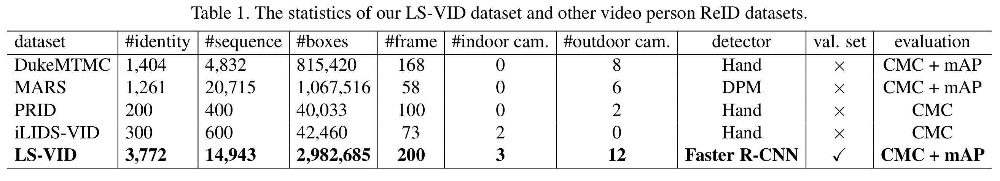
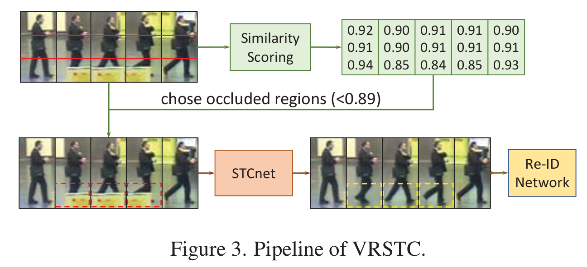

Recent papers on video person reid.

### [ICCV 2019: Co-segmentation Inspired Attention Networks for Video-based Person Re-identification](http://openaccess.thecvf.com/content_ICCV_2019/papers/Subramaniam_Co-Segmentation_Inspired_Attention_Networks_for_Video-Based_Person_Re-Identification_ICCV_2019_paper.pdf)

 * Why: Video-based Re-ID approaches have gained significant attention recently since a video, and not just an image, is often available.

* We propose a novel Co-segmentation in-
    spired video Re-ID deep architecture and formulate a Co-
    segmentation based Attention Module (COSAM) that **activates a common set of salient features across multiple frames of a video via mutual consensus in an unsupervised manner.** 
    As opposed to most of the prior work, our approach is able to **attend to person accessories along with the person.** 
    Our plug-and-play and interpretable COSAM module applied on two deep architectures (ResNet50, SE-ResNet50) outperform the state-of-the-art methods on three benchmark
    datasets

{:.lead data-width="200" data-height="100"}
{:.figure}

{:.lead data-width="200" data-height="100"}
{:.figure}

### [ICCV 2019: Global-Local Temporal Representations For Video Person Re-Identification](http://openaccess.thecvf.com/content_ICCV_2019/papers/Li_Global-Local_Temporal_Representations_for_Video_Person_Re-Identification_ICCV_2019_paper.pdf)

* This paper proposes the Global-Local Temporal Repre-
sentation (GLTR) to **exploit the multi-scale temporal cues in video sequences for video person Re-Identification (ReID).** GLTR is constructed by first modeling the **short-term temporal cues among adjacent frames**, then capturing the
**long-term relations among inconsecutive frames**. Specifically, the short-term temporal cues are modeled by **parallel dilated convolutions with different temporal dilation rates to represent the motion and appearance of pedestrian.** The long-term relations are captured by **a temporal self-attention model to alleviate the occlusions and noises in video sequences**. 
The short and long-term temporal cues are aggregated as the final GLTR by a simple single-stream CNN. GLTR shows substantial superiority to existing fea-
tures learned with body part cues or metric learning on four
widely-used video ReID datasets. For instance, it achieves
Rank-1 Accuracy of 87.02% on MARS dataset without re-
ranking, better than current state-of-the art.

{:.lead data-width="200" data-height="100"}
{:.figure}

{:.lead data-width="200" data-height="100"}
{:.figure}

{:.lead data-width="200" data-height="100"}
* ResNet 50, Input images are resized to
256×128, All
models are trained with only softmax loss.
* CSA: competitive snippet aggregation
* [STMP-Inception-v3](https://arxiv.org/pdf/1812.10305.pdf):  Liu et al. [29] propose a recurrent architecture to aggregate the frame-level representations and
yield a sequence-level human feature representation. **RNN
introduces a certain number of fully-connected layers and
gates for temporal cue modeling, making it complicated and
difficult to train**
* [M3D-ResNet50](https://arxiv.org/pdf/1811.07468.pdf): 3D convolution directly extracts spatial-temporal features through end-to-end CNN training. Recently, deep 3D
CNN is introduced for video representation learning. Tran
et al. [41] propose C3D networks for spatial-temporal feature learning. Qiu et al. [32] factorize the 3D convolutional
filters into spatial and temporal components, which yield
performance gains. **Li et al. [19] build a compact Multiscale 3D (M3D) convolution network to learn multi-scale
temporal cues. Although 3D CNN has exhibited promising performance, it is still sensitive to spatial misalignments
and needs to stack a certain number of 3D convolutional kernels, resulting in large parameter overheads and increased
difficult for CNN optimization.**
* [STA-ResNet50](https://arxiv.org/pdf/1811.04129.pdf): **STA introduces multi-branches for part feature
learning and uses triplet loss to promote the performance.**
Compared with those works, our method achieves competitive performance with simple design., e.g., we extract global
feature with basic backbone and train only with the softmax
loss. 
{:.figure}

### [ICCV 2019: Temporal Knowledge Propagation for Image-to-Video Person Re-identification](http://openaccess.thecvf.com/content_ICCV_2019/papers/Gu_Temporal_Knowledge_Propagation_for_Image-to-Video_Person_Re-Identification_ICCV_2019_paper.pdf)

* In many scenarios of Person Re-identification (Re-ID),
the gallery set consists of lots of surveillance videos and the
query is just an image, thus Re-ID has to be conducted be-
tween image and videos

{:.lead data-width="200" data-height="100"} 
{:.figure}

{:.lead data-width="200" data-height="100"} 
* We pre-train ResNet-50 on ImageNet [26] and adopt the
method in [33] to initialize the non-local blocks.
* During
training, we randomly sample 4 frames with a stride of 8
frames from the original full-length video to form an input
video clip.
* For iLIDS-VID, we first pre-train the
model on large-scale dataset and then fine-tune it on iLIDS-
VID following [31].
* In the test phase, the query image features are extracted
by image representation model. For each gallery video, we
first split it into several 32-frame clips. For each clip, we
utilize video representation model to extract video represen-
tation. The final video feature is the averaged representation
of all clips.
{:.figure}

### [CVPR 2019: Attribute-Driven Feature Disentangling and Temporal Aggregation for Video Person Re-Identification](http://openaccess.thecvf.com/content_CVPR_2019/papers/Zhao_Attribute-Driven_Feature_Disentangling_and_Temporal_Aggregation_for_Video_Person_Re-Identification_CVPR_2019_paper.pdf)

* In this paper, we
propose an attribute-driven method for feature disentan-
gling and frame re-weighting. **The features of single frames
are disentangled into groups of sub-features, each corre-
sponds to specific semantic attributes.** 
**The sub-features are
re-weighted by the confidence of attribute recognition and
then aggregated at the temporal dimension as the final rep-
resentation.** By means of this strategy, the most informa-
tive regions of each frame are enhanced and contributes to
a more discriminative sequence representation. Extensive
ablation studies verify **the effectiveness of feature disentan-
gling as well as temporal re-weighting**. The experimental
results on the iLIDS-VID, PRID-2011 and MARS datasets
demonstrate that our proposed method outperforms exist-
ing state-of-the-art approaches.

{:.lead data-width="200" data-height="100"} 
{:.figure}

{:.lead data-width="200" data-height="100"} 
{:.figure}

{:.lead data-width="200" data-height="100"} 
* Some existing methods perform pairwise
comparison to calculate the similarity between query and
gallery sequences, e.g. a pair of sequence are input to the
network for verification. This strategy is impracticable in
large-scale scenarios because all the gallery sequences need
to be calculated once for each query. An efficient practice
is extracting features of large gallery set once in an off-
line way and sorting them by Euclidean distances in fea-
ture space when given a query sequence.
* Our proposed
method, which does not require optical flow and pairwise
comparison, is more suitable for real-world applications.
Based on the same “Res50 + RGB-Only + Sing-Pass” set-
ting, our method significantly improves the mAP on MARS
by 10.5% and boosts the CMC-1 by 4.7%/6.1%/0.7% on
the three dataset.
{:.figure}

### [CVPR 2019: VRSTC: Occlusion-Free Video Person Re-Identification](http://openaccess.thecvf.com/content_CVPR_2019/papers/Hou_VRSTC_Occlusion-Free_Video_Person_Re-Identification_CVPR_2019_paper.pdf)

* Different from most
previous works that discard the occluded frames, **STCnet
can recover the appearance of the occluded parts.** For one
thing, the spatial structure of a pedestrian frame can be
used to predict the occluded body parts from the unoccluded
body parts of this frame. For another, the temporal patterns
of pedestrian sequence provide important clues to generate
the contents of occluded parts. With the spatio-temporal in-
formation, STCnet can recover the appearance for the oc-
cluded parts, which could be leveraged with those unoc-
cluded parts for more accurate video re-ID.

* We train ResNet-50
with cross-entropy loss to be the ID guider of STCNet.
In training term, four-frame input tracks are cropped out
from an input sequence. The frame features are extracted
by ResNet-50, then the average temporal pooling is used
to obtain the sequence feature. Input images are resized
to 256 × 128.

* We embed the non-local block [29] in
the re-ID network to capture temporal dependency of input
sequence.

{:.lead data-width="200" data-height="100"} 
{:.figure}

{:.lead data-width="200" data-height="100"} 
ResNet-50
{:.figure}

