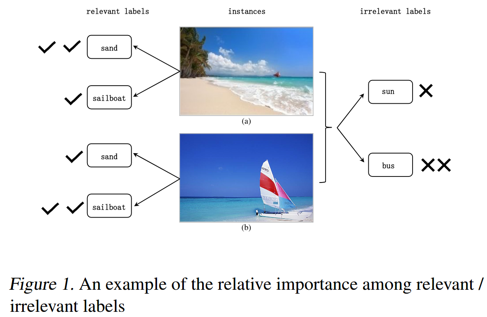
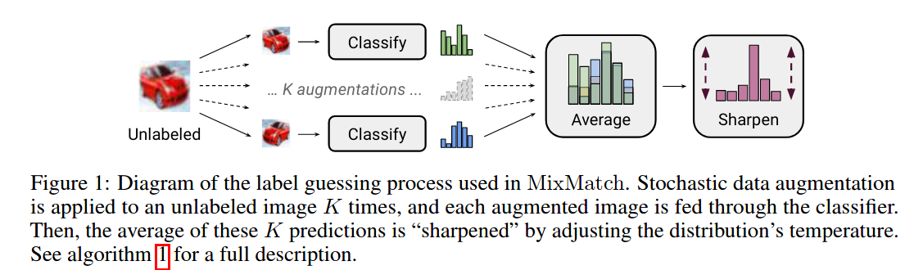
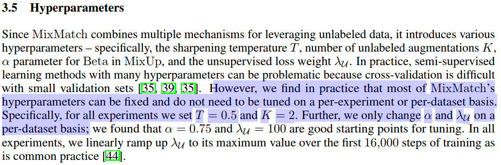
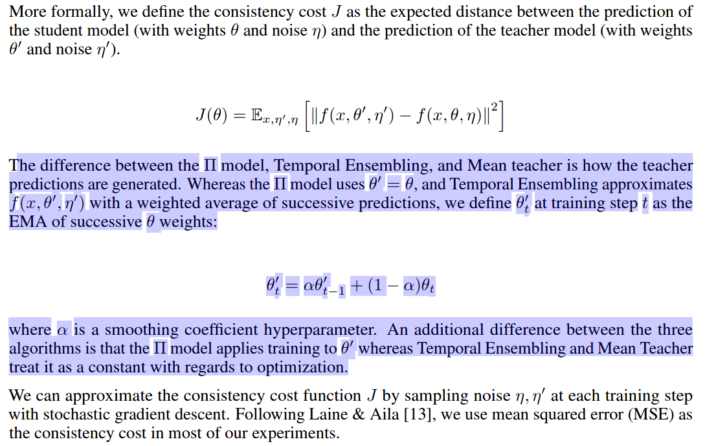

In general, robust deep learning covers: missing labels (semisupervised learning); noisy labels (noise detection and correction); regularisation techniques; sample imbalance (long-tailed class distribution); adversarial learning; and so on. 

Remark: in my reading notes, sometimes I simply quote texts directly from the original paper. Therefore, `we' means a paper's authors in many contexts. 

0. [Label noise](#label-noise)
0. [The design of loss functions (i.e., optimisation objectives or output regularistion)](#the-design-of-loss-functions-ie-optimisation-objectives-or-output-regularistion)
0. [Semi-supervised learning](#semi-supervised-learning)
0. [Others](#others)
{:.message}

### Label noise

* [Improving generalization by controlling label-noise information in neural network weights, Hrayr Harutyunyan, Kyle Reing, Greg Ver Steeg, Aram Galstyan](https://proceedings.icml.cc/static/paper_files/icml/2020/2896-Paper.pdf)
    
    * In the presence of noisy or incorrect labels, neural networks have the undesirable tendency to memorize information about the noise. Standard regularization techniques such as dropout, weight decay or data augmentation sometimes help, but do not prevent this behavior.

    * If one considers **neural network weights as random variables that depend on the data and stochasticity of training**, **the amount of memorized information can be quantified** with the Shannon mutual information between weight and the vector of all training labels given inputs $$I(w;y\|x)$$. 
     
    We show that for any training algorithm, low values of this term correspond to reduction in memorization of label-noise and better generalization bounds.

    * Drawback: An auxiliary network is used to detect incorrect or misleading labels. 
        * Simpler method: [DM and IMAE](../../blogs/2020-06-14-Robust-Deep-LearningviaDerivativeManipulationIMAE/)
        * Simpler method: [ProSelfLC](../../blogs/2020-06-07-Progressive-self-label-correction/)

* :+1: [Does label smoothing mitigate label noise? Michal Lukasik, Srinadh Bhojanapalli, Aditya Menon, Sanjiv Kumar](https://proceedings.icml.cc/static/paper_files/icml/2020/2305-Paper.pdf)
    
    * There is **a concurrent comprehensive analysis about label smoothing/manipulation: [ProSelfLC](../../blogs/2020-06-07-Progressive-self-label-correction/)**

    * We present **a novel connection of label smoothing to loss correction techniques** from the label noise literature; We empirically demonstrate that label smoothing significantly improves performance under label noise at varying noise levels, and **is competitive with loss correction techniques**.

    * We explain these denoising effects by **relating label smoothing to l2 regularisation**.
    
    * While Mülleret al. (2019) established that label smoothing can harm distillation, we show an opposite picture in noisy settings. We show that when distilling from noisy labels, smoothing the teacher improves the student;  this is in marked contrast to recent findings in noise-free settings.

* [Beyond Synthetic Noise: Deep Learning on Controlled Noisy Labels, Lu Jiang, Di Huang, Mason Liu, Weilong Yang](https://proceedings.icml.cc/static/paper_files/icml/2020/4834-Paper.pdf)
    
    * **“Webly-labeled” images** are commonly used in the literature (Bootkrajang & Kab ́an,2012; Li et al., 2017a; Krause et al., 2016; Chen & Gupta,2015), in which both images and labels are crawled fromthe web and the noisy labels are automatically determined by matching the images’ surrounding text to a class name during web crawling or equivalently by querying the search index afterward. Unlike synthetic labels, web labels follow a realistic label noise distribution but have not been studied in a controlled setting.

    * First, we establish **the first benchmark of controlled web label noise**, where each  training  example  is  carefully  annotated  to  indicate whether the label is correct or not.  Specifically, we automatically collect images by querying Google Image Searchusing a set of class names, have each image annotated by3-5 workers, and create training sets of ten controlled noiselevels. As the primary goal of our annotation is to identify images with incorrect labels, to obtain a sufficient numberof these images we have to collect a total of about 800,000 annotations over 212,588 images. The new benchmark enables us to go beyond synthetic label noise and study weblabel noise in a controlled setting. For convenience, we will refer it as web label noise (or red noise) to distinguish itfrom synthetic label noise (or blue noise). 
    
    * Second, this paper introduces a simple yet highly effective method to overcome both synthetic and real-world noisy labels. It is based on a new idea of minimizing the empirical vicinal risk using curriculum learning. We show that it consistently outperforms baseline methods on our datasets and achieves state-of-the-art performance on two public benchmarks of synthetic and real-world noisy labels. Notably, on the challenging benchmark WebVision 1.0 (Li et al., 2017a)that consists of 2.2 million images of real-world noisy labels,it yields a significant improvement of 3% in the top-1 accu-racy, achieving the best-published result under the standard training setting.
        * MentorMix: to design a new robust loss to overcome noisy labels using curriculum learning and vicinal risk minimization
        * MentorNet: curriculum learning
        * Mixup: data augmentation
    
    * Finally, we conduct **the largest study by far into understanding DNNs trained on noisy labels across a variety of noise types (blue and red), noise levels, training settings, and network architectures.**
    
    * We hope our **(i) benchmark, (ii) new method, and (iii) findings** will facilitate future deep learning research on noisy labeled data. We will release our data and code.

* [(arXiv-20-June) Early-Learning Regularization Prevents Memorization of Noisy Labels](https://arxiv.org/pdf/2007.00151.pdf)
    
    * Their analysis is similar with [DM and IMAE](https://xinshaoamoswang.github.io/blogs/2020-06-14-Robust-Deep-LearningviaDerivativeManipulationIMAE/), and they forgot to cite them in their first released version. 
        * Early in training, the gradients corresponding to the correctly labeled examples dominate the dynamics—leading to early progress towards the true optimum—but that the gradients corresponding to wrong labels soon become dominant—at which point the classifier simply learns to fit the noisy labels.

    * There are two key elements to our approach. (A regularization term that incorporates target probabilities estimated from the model outputs using several semi-supervised learning techniques.)
        * First, we **leverage semi-supervised learning techniques to produce target probabilities** based on the model outputs. 
        * Second, we design a regularization term that steers the model towards these targets, implicitly preventing memorization of the false labels.

    * We also perform a systematic ablation study to evaluate the different alternatives to **compute the target probabilities**, and the effect of incorporating mixup data augmentation.
        * Temporal ensembeling: averaging label predictions;
        * MeanTeachers: Weight-averaged consistency targets
        * MixMatch => DivideMix
        * Consistency regularisation: Interpolation Consistency Training

* [Error-Bounded Correction of Noisy Labels, Songzhu Zheng, Pengxiang Wu, Aman Goswami, Mayank Goswami, Dimitris Metaxas, Chao Chen](https://proceedings.icml.cc/paper/2020/file/87682805257e619d49b8e0dfdc14affa-Paper.pdf)
    * To be robust against label noise, many successful methods rely on the noisy classifiers (i.e., models trained on the noisy training data) to determine whether a label is trustworthy. However, it remains unknown why this heuristic works well in practice.
    
    * In this paper, **we provide the first theoretical explanation** for these methods.
    
    * We prove that the prediction of a noisy classifier can indeed be a good indicator of whether the label of a training data is clean.
    
    * Based on the theoretical result, we propose a novel algorithm that corrects the labels based on the noisy classifier prediction. The corrected labels are **consistent with the true Bayesian optimal classifier with high probability.**
    
    * We prove that when the noisy classifier has **low confidence on the label of a datum, such label is likely corrupted.** In fact, we can quantify the threshold of confidence, below which the label is likely to be corrupted, and above which is it likely to be not. We also empirically show that the bound in our theorem is tight.
    
    * We provide a theorem quantifying how a noisy classifier’s prediction correlates to the purity of a datum’s label. This provides theoretical explanation for data-recalibrating methods for noisy labels.
    
    * Inspired by the theorem, we propose **a new label correction algorithm with guaranteed success rate.**
    
    * **A Bayes optimal classifier is the minimizer of the risk over all possible hypotheses.**
    
    * We also have a burn-in stage in which we train the networkusing the original noisy labels for $$m$$ epochs. During theburn-in stage, we use the original cross-entropy loss;
    
    * After the burn-in stage, we want to avoid overfitting of theneural network. To achieve this goal, we introduce aretroactive loss term. The  idea  is  to  enforce  the consistency between $$f$$ and the prediction of the model at a previous epoch. 
    
    * In all experiments, **we use early stopping on validation set to tune hyperparameters and report theperformance on test set.**

    * **[Simple and Effective ProSelfLC: Progressive Self Label Correction](https://xinshaoamoswang.github.io/blogs/2020-06-07-Progressive-self-label-correction/)**

* [Deep k-NN for Noisy Labels Dara Bahri, Heinrich Jiang, Maya Gupta](https://proceedings.icml.cc/static/paper_files/icml/2020/2572-Paper.pdf)

    * In this paper, we provide an empirical study showing that a simple k-nearest neighbor-based filtering approach on the logit layer of a preliminary model can remove mislabeled training data and produce more accurate models than many recently proposed methods. 
     
    We use a deep k-NN, in that we use a k-NN on learned intermediate rep-resentations of a preliminary model to identify suspicious examples for filtering.
    
    * **After identifying examples whose labels disagree with their neighbors**, one can **either automatically remove them, or send them to a human operator for further review**. This strategy can also be useful in **human-in-the-loop systems** where one can warn the human annotator that a label is suspicious and automatically propose new labels based on its nearest neighbors.
        * **This is suspicious in that a softmax classifier is based on similarities (logits), then why not using the predictions directly as done in [ProSelfLC](../../blogs/2020-06-07-Progressive-self-label-correction/)?** 

    * **Theoretically**, we show that k-NN’s predictions will, asymptotically, only identify a training example as clean if its label is **the Bayes-optimal label**.
    
    * We also provide **finite-sample analysis** in terms of the margin and how spread-out the corrupted labels are (Theorem 1), rates of convergence for the margin (Theorem 2) and rates under Tsybakov’s noise condition (Theorem 3) with all rates matching minimax-optimal rates in the noiseless setting.

* [Normalized Loss Functions for Deep Learning with Noisy Labels Xingjun Ma, Hanxun Huang, Yisen Wang, Simone Romano, Sarah Erfani, James Bailey](https://proceedings.icml.cc/book/2020/hash/77f959f119f4fb2321e9ce801e2f5163)
    
    * **This work is motivated by [DM and IMAE](https://xinshaoamoswang.github.io/blogs/2020-06-14-Robust-Deep-LearningviaDerivativeManipulationIMAE/)**

    * We provide new theoretical insights into robust loss func-tions demonstrating that a simple normalization can makeany loss function robust to noisy labels.
    
    * We identify that existing robust loss functions suffer from an underfitting problem.  To address this, we propose ageneric framework Active Passive Loss(APL) to build new loss functions with **theoretically guaranteed robustness and sufficient learning properties.**
    
    * **Robustness and Convergence?**

* [SIGUA: Forgetting May Make Learning with Noisy Labels More Robust, Bo Han, Gang Niu, Xingrui Yu, QUANMING YAO, Miao Xu, Ivor Tsang, Masashi Sugiyama](https://proceedings.icml.cc/static/paper_files/icml/2020/705-Paper.pdf)
    
    * We propose stochastic integrated gradient underweighted ascent (SIGUA): in a mini-batch, we adopt gradient descent on good data as usual, and learning-rate-reduced gradient ascent on bad data;
    
    * Technically, SIGUA pulls optimization back for generalization when their goals conflict with each other;
    
    * Philosophically, SIGUA shows forgetting undesired memorization can reinforce desired memorization.
        * **The idea is similar with [DM and IMAE](https://xinshaoamoswang.github.io/blogs/2020-06-14-Robust-Deep-LearningviaDerivativeManipulationIMAE/)**

    * Almost the same authors as [Searching to Exploit Memorization Effect in Learning with Noisy Labels QUANMING YAO, Hansi Yang, Bo Han, Gang Niu, James Kwok](https://proceedings.icml.cc/book/2020/hash/72b386224056bf940cd5b01341f65e9d)

    

* [Searching to Exploit Memorization Effect in Learning with Noisy Labels, QUANMING YAO, Hansi Yang, Bo Han, Gang Niu, James Kwok](https://proceedings.icml.cc/static/paper_files/icml/2020/3285-Paper.pdf)
    
    * Sample selection approaches: select $$R(t)$$ small-loss samples based on network’s predictions
    
    * Formulation as an AutoML Problem  (complex algorithm personally);
    
    * Bi-level optimisation    
    
    * **No sample selection is needed: [DM and IMAE](https://xinshaoamoswang.github.io/blogs/2020-06-14-Robust-Deep-LearningviaDerivativeManipulationIMAE/)**
    
    * Almost the same authors as [SIGUA: Forgetting May Make Learning with Noisy Labels More Robust Bo Han, Gang Niu, Xingrui Yu, QUANMING YAO, Miao Xu, Ivor Tsang, Masashi Sugiyama](https://proceedings.icml.cc/static/paper_files/icml/2020/705-Paper.pdf)

* :+1: [Variational Label Enhancement, Ning Xu, Jun Shu, Yun-Peng Liu, Xin Geng](https://proceedings.icml.cc/static/paper_files/icml/2020/3104-Paper.pdf)
    
    * The learning process on the instances labeled by label distributions is called label distribution learning (LDL).
    
    * Unfortunately, many training sets only contain simple logical labels rather than label distributions due to the difficulty of obtaining the label distributions directly.
    
    * **This is consistent with the label definition in [ProSelfLC](../../blogs/2020-06-07-Progressive-self-label-correction/)** 
    {:.lead data-width="800" data-height="100"}{:.figure}

* [Peer Loss Functions: Learning from Noisy Labels without Knowing Noise Rates, Yang Liu, Hongyi Guo](https://proceedings.icml.cc/static/paper_files/icml/2020/4950-Paper.pdf)
    
    * Overall, this method is complex due to **peer samples**. 
    
    * **The motivation/highlight is not novel**: without Knowing Noise Rates.  Our main goal is to provide an al-ternative that does not require the specification of the noiserates, nor an additional estimation step for the noise.
    
    * Peer loss is invariant to label noise when optimizing with it. This effect helps us get rid of theestimation of noise rates.

    * i) is robust to asymmetriclabel noise with **formal theoretical guarantees**  and  ii)  requires  no  prior  knowledge  or  estimationof the noise rates (**no need for specifying noise rates**).

    * We also provide preliminary results on **how peer loss generalizes to multi-class clas-sification problems.**

    * Relevant work 1: [neurips-19: $$L_{DMI}$$: A Novel Information-theoretic Loss Functionfor Training Deep Nets Robust to Label Noise](https://papers.nips.cc/paper/8853-l_dmi-a-novel-information-theoretic-loss-function-for-training-deep-nets-robust-to-label-noise.pdf) To the best ofour knowledge, $$L_{DMI}$$ is the first loss function that is provably robust to instance-independent label noise, regardless of noise pattern, and it can be applied to any existing classification neural networks straightforwardly without any auxiliary information. In addition to theoretical justification, we also empirically show that using $$L_{DMI}$$ outperforms all other counterparts in the classification task on both image dataset and natural language dataset include Fashion-MNIST, CIFAR-10, Dogs vs. Cats, MR with a variety of synthesized noise patterns and noise amounts,as well as a real-world dataset Clothing1M.
    The core of $$L_{DMI}$$ is a generalized version of mutual information, termed Determinant based Mutual Information (DMI), which is not only information-monotone but also relatively invariant.

    * Relevant work 2: [Water from Two Rocks: Maximizing the Mutual Information](https://arxiv.org/pdf/1802.08887.pdf)

    * **No loss function is needed: [DM and IMAE](https://xinshaoamoswang.github.io/blogs/2020-06-14-Robust-Deep-LearningviaDerivativeManipulationIMAE/)**

* [Learning with Bounded Instance- and Label-dependent Label Noise, Jiacheng Cheng, Tongliang Liu, Kotagiri Ramamohanarao, Dacheng Tao](https://proceedings.icml.cc/paper/2020/file/f2d887e01a80e813d9080038decbbabb-Paper.pdf)
    
    * **Binary classification => Not highly generic.** 
    
    * Specifically, we introduce the concept of **distilled examples**, i.e. examples whose labels are identical with the labels assigned for them by the Bayes optimal classifier, and prove that **under certain conditions classifiers learnt on distilled examples will converge to the Bayes optimal classifier**. 
    
    *  Inspired by the idea of learning with distilled examples, we then propose a learning algorithm with **theoretical guarantees for its robustness to BILN**.

* [(ICLR-20) Junnan Li, Richard Socher, and Steven C.H. Hoi. DivideMix: Learning with noisy labels as semi-supervised learning.](https://openreview.net/forum?id=HJgExaVtwr&noteId=keqS67sTCbi)
    
    * [https://openreview.net/forum?id=HJgExaVtwr&noteId=keqS67sTCbi](https://openreview.net/forum?id=HJgExaVtwr&noteId=keqS67sTCbi)
        
        * **Exploiting MixMatch**;

        * [The algorithm is complex. Instead, DM, IMAE, and ProSelfLC are much simpler.](https://openreview.net/forum?id=HJgExaVtwr&noteId=keqS67sTCb) 

    * DivideMix models the per-sample loss distribution with a mixture model to **dynamically divide the training data into a labeled set with clean samples and an unlabeled set with noisy samples**, and trains the model on both the labeled and unlabeled data in a semi-supervised manner. 

    * To avoid confirmation bias, we simultaneously train two diverged networks where each network uses the dataset division from the other network. During the semi-supervised training phase, we improve the **MixMatch** strategy by performing **label co-refinement and label co-guessing on labeled and unlabeled samples**, respectively. 

    * DivideMix discards the sample labels that are highly likely to be noisy, and leverages the noisy samples as unlabeled data to regularize the model from overfitting and improve generalization performance.

    * For labeled samples, we refine their ground-truth labels using the network's predictions guided by the GMM for the other network. For unlabeled samples,we use the ensemble of both networks to make reliable guesses for their labels.

    * Training two networks, Co-divide datasets, label co-refinement and co-guessing.
        * improving MixMatch with label co-refinement and co-guessing. 
{:.message}

### The design of loss functions (i.e., optimisation objectives or output regularistion) 

* :+1: [Improved Training Speed, Accuracy, and Data Utilization Through Loss Function Optimization](https://arxiv.org/pdf/1905.11528.pdf) 
    
    * Speed, Accuracy, Data Efficiency, etc; 

    * BAIKAL loss;
    * Genetic Loss Function Optimization (GLO) builds loss functions hierarchically from a set of operators and leaf nodes;
    * A general framework for loss function metalearning, covering both novel loss function discovery and optimization, is developed and evaluated experimentally.
    * **No loss function is needed: [DM and IMAE](https://xinshaoamoswang.github.io/blogs/2020-06-14-Robust-Deep-LearningviaDerivativeManipulationIMAE/)**

* [Cyclical Learning Rates for Training Neural Networks](https://arxiv.org/pdf/1506.01186.pdf)

* [On loss functions for deep neural networks in classification => with theory of robustness and convergence](https://arxiv.org/pdf/1702.05659.pdf)

    * We try to investigate how particular choices of loss functions affect deep models and their learning dynamics, as well as resulting classifiers robustness to various effects;
    * We present new insights into theoretical properties of a couple of these losses;
    * We provide experimental evaluation of resulting models’ properties, including the effect on speed of learning, final performance, input data and label noise robustness as well as convergence.
    * So why is using these two loss functions ($$L_1$$, $$L_2$$ losses) unpopular? Is there anything fundamentally wrong with this formulation from the mathematical perspective? While the following observation is not definitive, it shows an insight into what might be the issue causing slow convergence of such methods.
    *  **Lack of convexity** comes from the same argument since **second derivative wrt. to any weight in the final layer of the model changes sign (as it is equivalent to first derivative being non-monotonic)**. 
    
    **Proposition 2**. $$L_1$$, $$L_2$$ losses applied to probabilities estimates coming
    from sigmoid (or softmax) have **non-monotonic partial derivatives wrt. to the output of the final layer (and the loss is not convex nor concave wrt. to last layer weights)**. Furthermore, **they vanish in both infinities, which slows down learning of heavily misclassified examples**.

    * **No loss function is needed: [DM and IMAE](https://xinshaoamoswang.github.io/blogs/2020-06-14-Robust-Deep-LearningviaDerivativeManipulationIMAE/)**
{:.message}

### Semi-supervised learning 

* [(CVPR-19) Ahmet Iscen et al Label Propagation for Deep Semi-supervised Learning](https://openaccess.thecvf.com/content_CVPR_2019/papers/Iscen_Label_Propagation_for_Deep_Semi-Supervised_Learning_CVPR_2019_paper.pdf)

* [(IJCAI-19) Consistency regularisation: Interpolation Consistency Training for Semi-supervised Learning, Vikas Verma, Alex Lamb, Juho Kannala, Yoshua Bengio, and David Lopez-Paz](https://www.ijcai.org/Proceedings/2019/0504.pdf)

    * ICT encourages the prediction at an interpolation of unlabeled points to be consistent with the interpolation of the predictions at those points.

    * In classification problems, ICT moves the decision boundary to low-density regions of the data distribution.

    * MixUp is used for preprocessing/data augmentation.

* [(NeurIPS-19) David Berthelot, Nicholas Carlini, Ian J. Goodfellow, Nicolas Papernot, Avital Oliver, and ColinRaffel. Mixmatch: A holistic approach to semi-supervised learning.](https://papers.nips.cc/paper/8749-mixmatch-a-holistic-approach-to-semi-supervised-learning.pdf)

    * This method is simple and effective. Their writing is also extremely naive to understand, instead of being fancy. 
    * Many recent approaches for semi-supervised learning add a loss term which is computed on unlabeled data and encourages the model to generalize better to unseen data:    
        * entropy minimization -- which encourages the model to output confident predictions on unlabeled data;
        * consistency regularization -- which encourages the model to produce the same output distribution when its inputs are perturbed;
        * generic regularization -- which encourages the model to generalize well and avoids overfitting the training data.
    * We introduce MixMatch, an SSL algorithm which introduces a single loss that gracefully unifies these dominant approaches to semi-supervised learning. We further show in an ablation study that MixMatch is greater than the sum of its parts;
    * [https://github.com/google-research/mixmatch](https://github.com/google-research/mixmatch)
    * In short, MixMatch introduces a unified loss term for unlabeled data that seamlessly reduces entropy while maintaining consistency and remaining compatible with traditional regularization techniques. 

    * Label guessing process used in MixMatch:
    {:.lead data-width="800" data-height="100"}{:.figure}

    * Question: if hyperparameters are not sensitive, why do we need it? Therefore, this writing is just for reviewers, not for readers. 
    {:.lead data-width="800" data-height="100"}{:.figure}

    * To set the stage for MixMatch, we first introduce existing methods for SSL. **We focus mainly on those which are currently state-of-the-art and thatMixMatchbuilds on; there is a wide literature onSSL techniques that we do not discuss here** (e.g., “transductive” models [14,22,21], graph-based methods [49,4,29], generative modeling [3,27,41,9,17,23,38,34,42], etc.). **More comprehensive overviews are provided in [49,6].**
    
    * MixUp is used for preprocessing/data augmentation. 

* [(ICLR-20) Junnan Li, Richard Socher, and Steven C.H. Hoi. DivideMix: Learning with noisy labels as semi-supervised learning.](https://openreview.net/forum?id=HJgExaVtwr&noteId=keqS67sTCbi)

    * [https://openreview.net/forum?id=HJgExaVtwr&noteId=keqS67sTCbi](https://openreview.net/forum?id=HJgExaVtwr&noteId=keqS67sTCbi)
        * **Exploiting MixMatch**;
        * The algorithm is complex. Instead, DM, IMAE, and ProSelfLC are much simpler. 

    * DivideMix models the per-sample loss distribution with a mixture model to **dynamically divide the training data into a labeled set with clean samples and an unlabeled set with noisy samples**, and trains the model on both the labeled and unlabeled data in a semi-supervised manner. 

    * To avoid confirmation bias, we simultaneously train two diverged networks where each network uses the dataset division from the other network. During the semi-supervised training phase, we improve the **MixMatch** strategy by performing **label co-refinement and label co-guessing on labeled and unlabeled samples**, respectively. 

    * DivideMix discards the sample labels that are highly likely to be noisy, and leverages the noisy samples as unlabeled data to regularize the model from overfitting and improve generalization performance.

    * For labeled samples, we refine their ground-truth labels using the network's predictions guided by the GMM for the other network. For unlabeled samples,we use the ensemble of both networks to make reliable guesses for their labels.

    * Training two networks, Co-divide datasets, label co-refinement and co-guessing.
        * improving MixMatch with label co-refinement and co-guessing. 

* [(NeurIPS-17 Antti Tarvainen and Harri Valpola. Mean teachers are better role models: Weight-averaged consistency targets improve semi-supervised deep learning results. )](https://papers.nips.cc/paper/6719-mean-teachers-are-better-role-models-weight-averaged-consistency-targets-improve-semi-supervised-deep-learning-results.pdf)

    * Because the targets change only onceper epoch, Temporal Ensembling becomes unwieldy when learning large datasets.
    * To overcome this problem, we propose Mean Teacher, a method that averages model weights instead of label predictions. As an additional benefit, Mean Teacher improves test accuracy and enables training with fewer labels than Temporal Ensembling. 
    * Abstract: Without changing the network architecture, Mean Teacher achieves anerror rate of 4.35% on SVHN with 250 labels, outperforming Temporal Ensembling trained with 1000 labels. We also show that a good network architecture is crucialto performance. Combining Mean Teacher and Residual Networks, we improve the state of the art on CIFAR-10 with 4000 labels from 10.55% to 6.28%, and on ImageNet 2012 with 10% of the labels from 35.24% to 9.11%.
    
    * Key algorithm:  
    {:.lead data-width="800" data-height="100"}{:.figure}

    * There are at least two ways to improve the target quality. One approach is to choose the perturbation of the representations carefully instead of barely applying additive or multiplicative noise. Another approach is to choose the teacher model carefully instead of barely replicating the student model.Concurrently to our research, [“Virtual Adversarial Training” (VAT)](https://arxiv.org/pdf/1704.03976.pdf) has taken the first approach and shown that Virtual Adversarial Training can yield impressive results. We take the second approach and will show that it too provides significant benefits. To our understanding, these two approaches are compatible, andtheir combination may produce even better outcomes. However, the analysis of their combined effectsis outside the scope of this paper.

    * About [TEMPORALENSEMBLING FORSEMI-SUPERVISEDLEARNING](https://openreview.net/pdf?id=BJ6oOfqge): Each target is updated only once per epoch, the learned information is incorporated into the training process at a slow pace. The larger the dataset, the longer the span of the updates, and in the case of on-line learning, it is unclear how Temporal Ensembling can be used at all. (One could evaluate all the targets periodically more than once per epoch, but keeping the evaluation span constant would require $$O(n^2)$$ evaluations per epoch where n is the number of training examples.)

* [(ICLR-17) Samuli Laine and Timo Aila. Temporal ensembling for semi-supervised learning. In ICLR, 2017.](https://openreview.net/pdf?id=BJ6oOfqge)

    * We introduce **self-ensembling**, where we form **a consensus prediction of the unknown labels** using the outputs of the network-in-training on differentepochs, and most importantly, under different regularization and input augmentation conditions. **This ensemble prediction can be expected to be a better predictorfor the unknown labels than the output of the network at the most recent training epoch**, and can thus be used as a target for training;

* [Unlabelled Data Improves Bayesian Uncertainty Calibration under Covariate Shift Alexander Chan, Ahmed Alaa, Zhaozhi Qian, Mihaela van der Schaar](https://proceedings.icml.cc/static/paper_files/icml/2020/2888-Paper.pdf)

    * While existing variants of BNNs are able to produce reliable, albeit approximate, uncertainty estimates over in-distribution data, it has been shown that they tend to be overconfident in predictions made on target data whose distribution over features differs from the training data, i.e., **the covariate shift setup**.
    * We develop **an approximate Bayesian inference scheme** based on posterior regularisation, where we use information from **unlabelled target data to produce more appropriate uncertainty estimates for ''covariate-shifted'' predictions.**
    * Empirical evaluations demonstrate that our method performs competitively compared to Bayesian and frequentist approaches to **uncertainty estimation in neural networks.**
        
        * uncertainty estimation:  quantifying confidence in their predictions — this is crucial in **high-stakes applications that involve critical decision-making**.
        
        * We make the following observation: **a point being in the target data is an indication that the model should output higher uncertainty** because the target distribution is not well-represented by training data due to covariate shift.
        **We use whether the data come from training or target set as a “pseudo-label”of model confidence.**
        
        * BNN learns a posterior distribution over parametersthat encapsulates the model uncertainty. Due the complexityof deep neural networks, the exact posterior is usually intractable. Hence, much of the research in BNN literature is devoted to finding better approximate inference algorithms for the posterior.

    * We note  that  most  existingworks in SSL focus entirely on using unlabelled data toimprove predictive performance (e.g. accuracy), but muchless thoughts have been given to improving the uncertainty estimate for those predictions, which is the focus of this paper. 

    * **Semi-supervised Learning**: Many recent works encourage the model to generalise better by using a regularisation term computed on the unlabelled data [MixMatch Berth-elot et al. (NeurIPS 2019)](https://papers.nips.cc/paper/8749-mixmatch-a-holistic-approach-to-semi-supervised-learning.pdf).
        *  **Consistency regularization** applies data augmentation to semi-supervised learning by leveraging the idea that a classifier should output the same class distribution for an unlabeled example even after it has been augmented. 
            * E.g. 1: [(TPAMI 2018) “Virtual Adversarial Training” (VAT)](https://arxiv.org/pdf/1704.03976.pdf) addresses this by instead computing an additive perturbation to apply to the input which maximally changes the output class distribution;
            * E.g. 2: [(NeurIPS 2017) “Mean Teacher”: a method that averages model weights instead of label predictions.](https://papers.nips.cc/paper/6719-mean-teachers-are-better-role-models-weight-averaged-consistency-targets-improve-semi-supervised-deep-learning-results.pdf) uses an exponential moving average of model parameter values. This provides a more stable target and was found empirically to significantly improve results. 
            Mean Teacher improves test accuracy and enables training with fewer labels than Temporal Ensembling.
            Combining Mean Teacher and Residual Networks, we improvethe state of the art on CIFAR-10 with 4000 labels from 10.55% to 6.28%, and on ImageNet 2012 with 10% of the labels from 35.24% to 9.11%.
            * E.g. 3: [MixMatch Berth-elot et al. (NeurIPS 2019)](https://papers.nips.cc/paper/8749-mixmatch-a-holistic-approach-to-semi-supervised-learning.pdf) utilizes a form of consistency regularization through the use of standard data augmentation for images (random horizontal flips and crops).
            * [Connections](https://papers.nips.cc/paper/6719-mean-teachers-are-better-role-models-weight-averaged-consistency-targets-improve-semi-supervised-deep-learning-results.pdf): There are at least two ways to improve the target quality. One approach is to choose the perturbation of the representations carefully instead of barely applying additive or multiplicative noise. Another approach is to choose the teacher model carefully instead of barely replicating the student model.Concurrently to our research, [“Virtual Adversarial Training” (VAT)](https://arxiv.org/pdf/1704.03976.pdf) has taken the first approach and shown that Virtual Adversarial Training can yield impressive results. We take the second approach and will show that it too provides significant benefits. To our understanding, these two approaches are compatible, andtheir combination may produce even better outcomes. However, the analysis of their combined effectsis outside the scope of this paper.
            * About [TEMPORALENSEMBLING FORSEMI-SUPERVISEDLEARNING](https://openreview.net/pdf?id=BJ6oOfqge): Each target is updated only once per epoch, the learned information is incorporated into the training process at a slow pace. The larger the dataset, the longer the span of the updates, and in the case of on-line learning, it is unclear how Temporal Ensembling can be used at all. (One could evaluate all the targets periodically more than once per epoch, but keeping the evaluation span constant would require $$O(n^2)$$ evaluations per epoch where n is the number of training examples.)
        
        * **Entropy Minimization**: CCE, [ProSelfLC](https://xinshaoamoswang.github.io/blogs/2020-06-07-Progressive-self-label-correction/), [(NeurIPS) Semi-supervised learning by entropy minimization](https://papers.nips.cc/paper/2740-semi-supervised-learning-by-entropy-minimization.pdf), [(ICML workshop 2013) Pseudo-Label](http://deeplearning.net/wp-content/uploads/2013/03/pseudo_label_final.pdf)

        * **Traditional Regularization**: weight decay, MixUP, etc. 

        * More work on semi-supervised learning: 
            * [(NeurIPS 2018) Entropy minimisation: Jean, N., Xie, S. M., and Ermon, S. Semi-supervised deep kernel learning: Regression with unlabeled data by minimizing predictive variance.](https://papers.nips.cc/paper/7778-semi-supervised-deep-kernel-learning-regression-with-unlabeled-data-by-minimizing-predictive-variance.pdf)
            * [(NeurIPS 2016) Consistency regularisation: Sajjadi, M., Javanmardi, M., and Tasdizen, T.  Regulariza-tion with stochastic transformations and perturbations fordeep semi-supervised learning.](https://papers.nips.cc/paper/6333-regularization-with-stochastic-transformations-and-perturbations-for-deep-semi-supervised-learning.pdf)
            * [(IJCAI 20019) Consistency regularisation: Interpolation Consistency Training for Semi-supervised Learning  Vikas Verma, Alex Lamb, Juho Kannala, Yoshua Bengio, and David Lopez-Paz](https://www.ijcai.org/Proceedings/2019/0504.pdf)

* [Poisson Learning: Graph Based Semi-Supervised Learning At Very Low Label Rates Jeff Calder, Brendan Cook, Matthew Thorpe, Dejan Slepcev](https://proceedings.icml.cc/static/paper_files/icml/2020/4874-Paper.pdf)

    * The  need  to  address  the  degeneracy of Laplacian semi-supervised learning
    * Geometric or topological structure in unlabeled data can be used
    * The exact nature of the degeneracy in Laplace learning, and the question of how the tails of the spikes propagate label information, has not been studied and is still poorly understood.
    * We carefully analyze Laplace learning at very low label rates, and we discover that nearly all of the degeneracy of Laplace learning is due to a large constant bias in the solution of the Laplace equation that is present only at low label rates. In order to overcome this problem we introduce a new algorithm, we call Poisson learning

* [Safe Deep Semi-Supervised Learning for Unseen-Class Unlabeled Data Lan-Zhe Guo, Zhen-Yu Zhang, Yuan Jiang, Yufeng Li, Zhi-Hua Zhou](https://proceedings.icml.cc/static/paper_files/icml/2020/3231-Paper.pdf)

    * The performance  is  seriously  decreased  when  the class  distribution  is  mismatched,  among  which the common situation is that unlabeled data contains some classes not seen in the labeled data.

* Semi-Supervised Learning Using Gaussian Fields and Harmonic Functions

* [Semi-Supervised Learning Literature Survey](http://pages.cs.wisc.edu/~jerryzhu/pub/ssl_survey.pdf)

* [On semi-supervised learning](https://arxiv.org/pdf/1805.09180.pdf)
{:.message}

### Others
* [Certified Robustness to Label-Flipping Attacks via Randomized Smoothing, Elan Rosenfeld, Ezra Winston, Pradeep Ravikumar, Zico Kolter](https://proceedings.icml.cc/static/paper_files/icml/2020/2565-Paper.pdf)

    * In this work,we propose a strategy for building **linear classifiers** that are certifiably robust against a strong variant of label flipping, where **each test example is targeted independently**. 
     
    For each test point, our classifier includes a certification that its prediction would be the same had some number of training labels been changed adversarially.
    
    * We generalize our results to the multi-class case, providing the first multi-class classification algorithm that is certifiably robust to label-flipping attacks.

    * we propose **a pointwise certified defense**—this means that **with each prediction**, the classifier includes a certification guaranteeing that its prediction would not be different had it been trained on data with some number oflabels flipped.

    * **Prior works on certified defenses make statistical guarantees over the entire test distribution** (rather than at the population level), but they make no guarantees as to the robustness of a predictionon any particular test point; thus, a determined adversary could still cause a specific test point to be misclassified. 
     
    We therefore consider the threat of **a worst-case adversary** that can make a training set perturbation to target each test point individually.

* [Progressive Identification of True Labels for Partial-Label Learning Jiaqi Lv, Miao Xu, LEI FENG, Gang Niu, Xin Geng, Masashi Sugiyama](https://proceedings.icml.cc/static/paper_files/icml/2020/6080-Paper.pdf)

    * **Partial-label learning** is one of the important **weakly supervised learning problems**, where each training example is equipped with **a set of candidate labels** that contains the true label.

* [Label-Noise Robust Domain Adaptation Xiyu Yu, Tongliang Liu, Mingming Gong, Kun Zhang, Kayhan Batmanghelich, Dacheng Tao](https://proceedings.icml.cc/static/paper_files/icml/2020/1942-Paper.pdf)

    * State-of-the-art domain adaptation methods make use of deep networks to extract domain-invariant representations. 

    * Existing methods assume that all the instances in the source domain are correctly labeled;  while in reality, it is unsurprising that we may obtain a source domain with noisy labels.

    * In this paper, we are the first to comprehensively investigate how label noise could adversely affect existing domain adaptation methods in various scenarios.

    * Further,  we theoretically prove that there exists a method that can essentially reduce the side-effect of noisy source labels in domain adaptation.

* [Self-supervised Label Augmentation via Input Transformations, Hankook Lee, Sung Ju Hwang, Jinwoo Shin](https://proceedings.icml.cc/static/paper_files/icml/2020/2048-Paper.pdf)

    * How can we effectively utilize the transformation-based self-supervision for fully-supervised classification tasks?

* [Federated Learning with Only Positive Labels Felix Xinnan Yu, Ankit Singh Rawat, Aditya Menon, Sanjiv Kumar](https://proceedings.icml.cc/book/2020/hash/2e2079d63348233d91cad1fa9b1361e9) 
{:.message}
