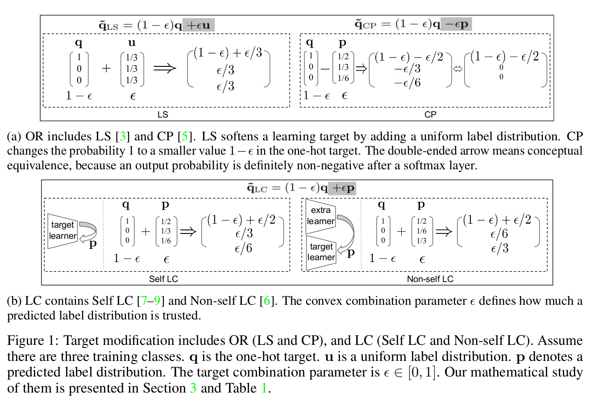
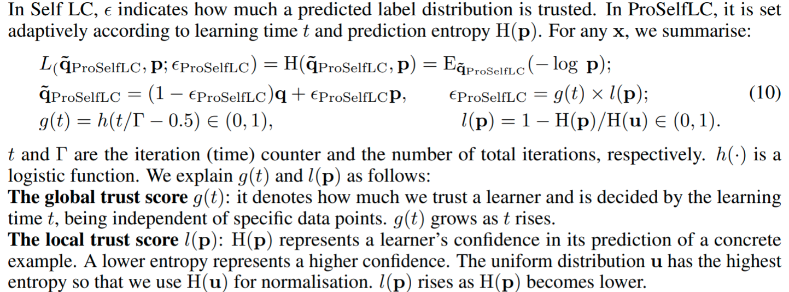
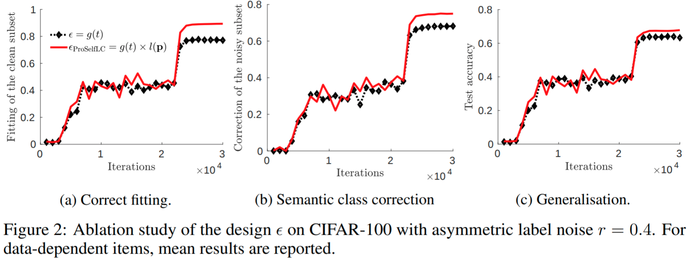

For any specific discussion or potential future collaboration, please feel free to contact me. As a young
researcher, your interest and star (citation) will mean a lot for me and my collaborators. For source codes, we
are happy to provide if there is a request conditioned on academic use only and kindness to cite this work.<br />
Paper link: [ProSelfLC_arXiv_07062020.pdf](../figsProSelfLC/ProSelfLC_arXiv_07062020.pdf)
```
@article{wang2020proselflc,
  title={ProSelfLC: Progressive Self Label Correction 
  for Training Robust Deep Neural Networks},
  author={Wang, Xinshao and Hua, Yang and Kodirov, Elyor and Robertson, Neil M},
  journal={arXiv preprint arXiv:2005.03788},
  year={2020}
}
```

<!-- :+1: means being highly related to my personal research interest. -->
List of Content
0. [Storyline](#storyline)
0. [Open ML Research Questions](#open-ml-research-questions)
0. [Noticeable Findings](#noticeable-findings)
0. [Literature Review](#literature-review)
0. [In Self LC, a core question is not well answered](#in-self-lc-a-core-question-is-not-well-answered)
0. [Underlying Principle of ProSelfLC](#underlying-principle-of-proselflc)
0. [Mathematical Details of ProSelfLC](#mathematical-details-of-proselflc)
0. [Design Reasons of ProSelfLC](#design-reasons-of-proselflc)
0. [Related Interesting Work](#related-interesting-work)
{:.message}

## Storyline
* Human annotations contain bias, subjectiveness, and errors. 
    * Therefore, some prior work **penalises low-entropy statuses => so that wrong fitting is alleviated in some degree.** Representative proposals are label smoothing and confidence penalty.

* Our new finding on **Entropy Minimisation**: 
    * We can solve it still by minimum entropy regularisation principle;
    * Diverse minimum-entropy statuses exist (e.g., when a learner perfectly fits random labels, the entropy also reaches a minimum):
        * The minimum-entropy status defined by untrusted human-annotated labels is incorrect, thus leading to poor generalisation. \\
        **CCE => Non-meaningful minimum-entropy status => poor generalisation**.
        * We propose to redefine a more meaningful minimum-entropy status by exploiting the knowledge of a learner itself, which shows promising results.  \\
        **Label correction => Meaningful low-entropy status => good generalisation**.

* We highlight **ProSelfLC's Underlying Principle is ''Contradictory'' with: Maximum-Entropy Learning, Confidence Penalty and Label Smoothing**, which are popular recently. 
Then we wish our community think critically about two principles: 
    * **Rewarding a correct low-entropy status** (ProSelfLC)   
    * **Penalising a non-meaningful low-entropy status** (CCE+LS, or CCE+CP)
    * In our experiments: **ProSelfLC > (CCE+LS, or CCE+CP) > CCE**
    * Or not contradictory, instead the angle differs: 
        * CCE fits non-meaningful patterns => LS/CP penalises the fitting
        * CCE fits non-meaningful patterns => ProSelfLC first corrects the patterns => then fits
        
* Why does CCE fit non-meaningful patterns? 
    * [2019-Derivative manipulation for general example weighting](https://arxiv.org/pdf/1905.11233.pdf)
    * [2019-IMAE for noise-robust learning: Mean absolute error does not treat examples equally and gradient magnitude’s variance matters.](https://arxiv.org/pdf/1903.12141.pdf)
{:.message}

## Open ML Research Questions
* Should we trust and exploit a learner’s knowledge as training goes, or always trust human
annotations?
* Should we optimise a learner towards a correct low-entropy status, or penalise a low-entropy
status?
* Open discussion: we show it’s fine for a learner to be confident towards a correct low-entropy status.
Then more future research attention should be paid to the definition of correct knowledge, as in general we
accept, human annotations used for learning supervision may be biased, subjective, and wrong.
{:.message}

## Noticeable Findings
* Rewarding low entropy (towards a meaningful status) leads to better generalisation than penalising low entropy.
{:.message}

Comprehensive learning dynamics for thorough understanding of learning behaviours.
{:.lead data-width="800" data-height="100"}
{:.figure}
* Result analysis:
    * **Revising the semantic class and perceptual similarity structure.** Generally, the semantic class of an example is defined according to its perceptual similarities with training classes, and is chosen to be the most similar class. In Figure 3b and 3c, we show a learner’s behaviours on without fitting wrong labels and correcting them in different approaches. We remark that ProSelfLC performs the best.
    <br />
    <br />
    * **To reward or penalise low entropy?** LS and CP are proposed to penalise low entropy. On the one hand, we observe that LS and CP work, being consistent with prior evidence. As shown in Figure 3d and 3e, the entropies of both clean and noisy subset are the largest in LS and CP, and correspondingly their generalisation performance is the best except for ProSelfLC in Figure 3f. On the other hand, our ProSelfLC has the lowest low entropy while performs the best, which demonstrates **it does not hurt for a learner to be confident. However, a learning model needs to be careful about what to be confident in.** Let us look at Figure 3b and 3c, ProSelfLC has the least wrong fitting while the highest semantic class correction rate, which denotes it is confident in learning meaningful patterns.
{:.message}

## Literature Review

Target modification includes OR (LS and CP), and LC (Self LC and Non-self LC). <br />
Self LC is the most appealing because it requires no extra learners to
revise learning targets, <br /> 
being free! <br />
{:.lead data-width="800" data-height="100"}
{:.figure}

Summary of CCE, LS, CP and LC from the angle of target modification, entropy and KL divergence.
{:.lead data-width="800" data-height="100"}
{:.figure}


## In Self LC, a core question is not well answered:
$$\textit{How much do we trust a learner to leverage its knowledge?}$$
{:.message}


## Underlying Principle of ProSelfLC
* When a learner starts to learn, it trusts the supervision from human annotations. 
<br />
<br />
This idea is inspired by the paradigm that deep models learn simple meaningful patterns before fitting noise, even when severe label noise exists in human annotations [1];
<br />
<br />
* As a learner attains confident knowledge as time goes, we leverage its confident knowledge to correct labels. 
<br />
<br />
This is surrounded by minimum entropy regularisation, which has been widely evaluated in unsupervised and semi-supervised scenarios [10, 2].
{:.message}


## Mathematical Details of ProSelfLC

Beyond semantic class: the similarity structure defined by a label distribution.
{:.lead data-width="800" data-height="100"}
{:.figure}


Human annotations and predicted label distributions, which should we trust more?
{:.lead data-width="800" data-height="100"}
{:.figure}


## Design Reasons of ProSelfLC
*  Regarding $$g(t)$$, 
in the earlier learning phase, i.e., $$t < \Gamma/2$$, $$g(t) < 0.5 \Rightarrow \epsilon_{\mathrm{ProSelfLC}} < 0.5, \forall \mathbf{p}$$, so that the human annotations dominate and ProSelfLC only modifies the similarity structure. This is because when a learner does not see the training data for enough times, we assume it is not trained well, which is the most elementary concept in deep learning. Most importantly, more randomness exists at the earlier phase, as a result, the learner may output a wrong confident prediction. In our design, $$\epsilon_{\mathrm{ProSelfLC}} < 0.5, \forall \mathbf{p}$$ can assuage the bad impact of such unexpected cases.   
When it comes to the later learning phase, i.e., $$t > \Gamma/2$$, we have $$g(t) > 0.5$$, which means overall we give enough credits to a learner as it has been trained for more than the half of total iterations. 

*  Regarding $$l(\mathbf{p})$$, we discuss its effect in the later learning phase when it becomes more meaningful. 
If $$\mathbf{p}$$ is not confident, $$l(\mathbf{p})$$ will be large, then $$\epsilon_{\mathrm{ProSelfLC}}$$ will be small, which means we choose to trust a one-hot annotation more when its prediction is of high entropy, so that we can further reduce the entropy of output distributions}. In this case, ProSelfLC only modifies the similarity structure.
Beyond, when $$\mathbf{p}$$ is highly confident, there are two fine cases: If $$\mathbf{p}$$ is consistent with $$\mathbf{q}$$ in the semantic class, ProSelfLC only modifies the similarity structure too; If they are inconsistent, ProSelfLC further corrects the semantic class of a human annotation. 


Ablation study on the design of ProSelfLC, where $$\epsilon_{\mathrm{ProSelfLC}}$$ consistently performs the best when multiple metrics are reported. 
{:.lead data-width="800" data-height="100"}
{:.figure}


Case analysis on the design of ProSelfLC.
{:.lead data-width="800" data-height="100"}
{:.figure}

* **Correct the similarity structure for every data point in all cases.**
Given any data point $$\mathbf{x}$$, by a convex combination of $$\mathbf{p}$$ and $$\mathbf{q}$$, 
we add the information about its relative probabilities of being different training classes using the knowledge of a learner itself. 


* **Revise the semantic class of an example only when the learning time is long and its prediction is confidently inconsistent.**
As highlighted in Table 2, only when two conditions are met, we have $$\epsilon_{\mathrm{ProSelfLC}}  > 0.5$$ and 
$$\argmax\nolimits_j \mathbf{p}(j|\mathbf{x}) \neq \argmax\nolimits_j \mathbf{q}(j|\mathbf{x})$$, then the semantic class in $\mathbf{\tilde{q}_{\mathrm{ProSelfLC}}}$ is changed to be determined by $$\mathbf{p}$$. 
For example, we can deduce $$\mathbf{p} = [0.95, 0.01, 0.04], \mathbf{q} = [0, 0, 1], \epsilon_{\mathrm{ProSelfLC}}=0.8 \Rightarrow \mathbf{\tilde{q}_{\mathrm{ProSelfLC}}}=(1- \epsilon_{\mathrm{ProSelfLC}})  \mathbf{q}+\epsilon_{\mathrm{ProSelfLC}} \mathbf{p}=[0.76, 0.008, 0.232]$$.  
Theoretically, ProSelfLC also becomes robust against long time being exposed to the training data, so that early stopping is not required.
{:.message}


## Related Interesting Work
* Contradictory Underlying Principle: Maximum-Entropy Learning, Confidence Penalty, Label Smoothing
    * [Confidence Penalty is proposed in Regularizing Neural Networks by Penalizing Confident Output Distributions](https://arxiv.org/pdf/1701.06548.pdf)
    * [Label Smoothing is proposed in Rethinking the Inception Architecture for Computer Vision](https://arxiv.org/pdf/1512.00567.pdf)
    * [Maximum Entropy Fine-Grained Classification](https://papers.nips.cc/paper/7344-maximum-entropy-fine-grained-classification.pdf)
* Deep models learn simple meaningful patterns before fitting noise, even when severe label noise exists in human annotations. 
    * [2019-Derivative manipulation for general example weighting](https://arxiv.org/pdf/1905.11233.pdf)
    ```
    @article{wang2019derivative,
        title={Derivative Manipulation for
        General Example Weighting},
        author={Wang, Xinshao and Kodirov, Elyor and Hua, Yang and Robertson, Neil M},
        journal={arXiv preprint arXiv:1905.11233},
        year={2019}
    }
    ```
    * [2019-IMAE for noise-robust learning: Mean absolute error does not treat examples equally and gradient magnitude’s variance matters.](https://arxiv.org/pdf/1903.12141.pdf)
    ```
    @article{wang2019imae,
        title={ {IMAE} for Noise-Robust Learning: Mean Absolute Error Does Not Treat Examples Equally 
        and Gradient Magnitude's Variance Matters},
        author={Wang, Xinshao and Hua, Yang and Kodirov, Elyor and Robertson, Neil M},
        journal={arXiv preprint arXiv:1903.12141},
        year={2019}
    }
    ```
    * Arpit, D., Jastrz ̨ebski, S., Ballas, N., Krueger, D., Bengio, E., Kanwal, M.S., Maharaj, T., Fischer, A., Courville, A., Bengio, Y., Lacoste-Julien, S.: A closer look at memorization in deep networks. In: ICML. (2017)
{:.message}
